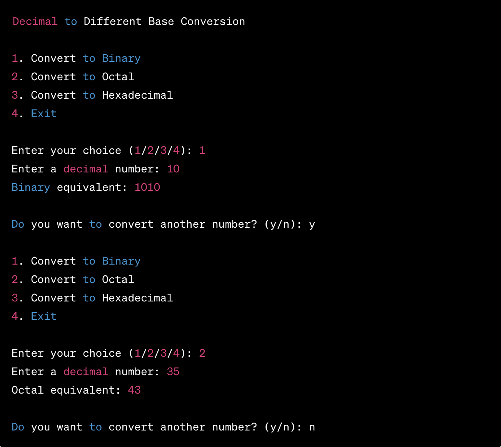

## Decimal to Different Base Conversion

**Assignment Description:**

In this C programming assignment, you will implement a program that converts decimal numbers to different base number systems. You will write a C program that takes a decimal number as input and allows the user to choose the base (binary, octal, or hexadecimal) to which the number will be converted. The program should display the result in the chosen base.

**Requirements:**

1. Your program should provide a user-friendly menu to choose the base for conversion (binary, octal, or hexadecimal).

2. The program should then prompt the user to enter a decimal number to convert.

3. Implement the conversion functions for each base:
   - Binary: Convert the decimal number to binary.
   - Octal: Convert the decimal number to octal.
   - Hexadecimal: Convert the decimal number to hexadecimal.

4. Ensure that the program handles invalid inputs gracefully. For example, if the user enters a negative number or a non-integer value, the program should display an error message and request input again.

5. Use appropriate C data types for storing and displaying the numbers.

6. The program should display the result in the chosen base and give the user the option to convert more numbers.

**Sample Output:**

**Submission Guidelines:**

- Your code should be well-documented, and variable names should be meaningful.
- Ensure proper error handling and input validation.
- Submit your source code (.c file) and header file (.h file) along with any necessary instructions on how to compile and run the program.

**Grading Criteria:**

1. Correctness of the conversion functions.
2. User interface and menu design.  
  a. Your menu should look EXACTLY like the image above. You can find out how to color output in printf() with a quick Google search.
3. Error handling and input validation.
4. Code organization and documentation.  
  a. Be sure to encapsulate functionality into functions wherever possible.  
  b. Include a comment block at the beginning and descriptive comments throughout your code.
5. Testing.  
  a. Be sure to use Test-Driven Development. Your testing will be evaluated more stringently as the semester goes on.

Feel free to enhance this assignment by adding extra features or constraints as needed.